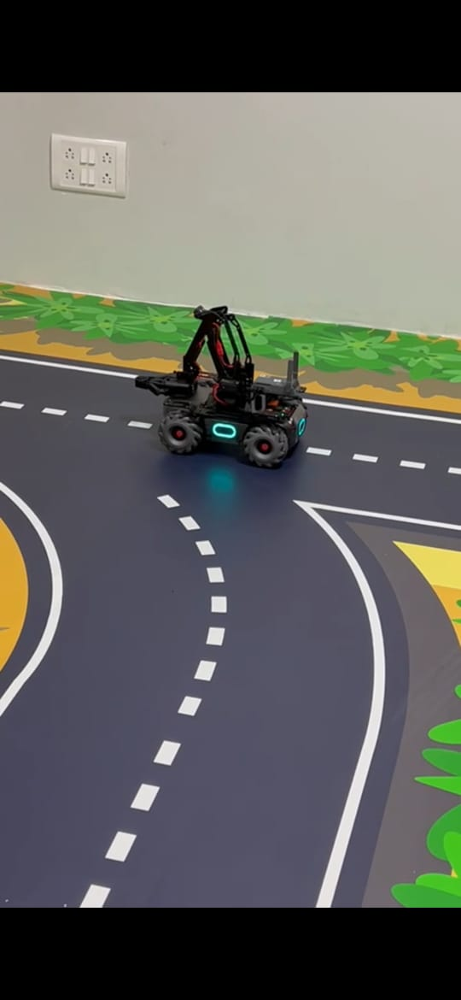

# MobileRobot-Openloopcontrol
## Aim:

To develop a python control code to move the mobilerobot along the predefined path.

## Equipments Required:
1. RoboMaster EP core
2. Python 3.7

## Procedure

Step1:
 import module robot from robomaster.
<br/>

Step2:
Choose the x,y,z - axis movement distance (meters)
<br/>

Step3:
Give ep_chases.move to move straight.
<br/>

Step4:
Give time.sleep() for break
<br/>

Step5:
Give ep_led for color in led.
<br/>

## Program
led_blink.py
```
rom robomaster import robot
import time


if _name_ == '_main_':
    ep_robot = robot.Robot()
    ep_robot.initialize(conn_type="ap")

    ep_led = ep_robot.led
    '''
    comp – enum: (“all”, “top_all”, “top_right”, “top_left”, “bottom_all”, “bottom_front”, “bottom_back”, “bottom_left”, “bottom_right”) lighting parts, all: all armor lights ;top_all: all armored lights of the gimbal; top_right: armored lights on the right side of the gimbal; top_left: armored lights on the left of the gimbal; bottom_all: all armored lights on the chassis; bottom_front: front armored lights; bottom_back: rear armored lights; bottom_left: left armored lights light; bottom_right: right armor light
    r – int: [0~255], RGB red component value
    g – int: [0~255], RGB green component value
    b – int: [0~255], RGB blue component value
    effect – enum: (“on”, “off”, “flash”, “breath”, “scrolling”) lighting effect type, on: always on; off: always off; flash: blinking; breath: breathing; scrolling: horse racing Lamp (only valid for PTZ lamp)
    '''
    for i in range(2):
        ep_led.set_led(comp="all",r=255,g=215,b=0,effect="on")   
        time.sleep(2)
        ep_led.set_led(comp="all",r=255,g=69,b=0,effect="on")
        time.sleep(2)
        ep_led.set_led(comp="all",r=255,g=105,b=180,effect="on")
        time.sleep(2)        
    
    print("Completed...")
    ep_robot.close()
```
linear_movement.py
```

    from robomaster import robot
import time

if _name_ == '_main_':
    ep_robot = robot.Robot()
    ep_robot.initialize(conn_type="ap")

    ep_chassis = ep_robot.chassis

    '''
    x = x-axis movement distance,( meters) [-5,5]
    y = y-axis movement distance,( meters) [-5,5]
    z = rotation about z axis ( degree)[-180,180]
    xy_speed = xy axis movement speed,( unit meter/second) [0.5,2]
    '''
    ep_chassis.move(x=2, y=0, z=0, xy_speed=0.75).wait_for_completed()

    ep_chassis.move(x=0, y=0, z=55, xy_speed=1).wait_for_completed()

    ep_chassis.move(x=1.6, y=0, z=0, xy_speed=0.75).wait_for_completed()

    ep_chassis.move(x=0, y=0, z= -95, xy_speed=0.75).wait_for_completed()

    ep_chassis.move(x=1.5, y=0, z=0, xy_speed=0.75).wait_for_completed()


    ep_robot.close()
```
circular_movement.py

```
    from robomaster import robot
import time

if _name_ == '_main_':
    ep_robot = robot.Robot()
    ep_robot.initialize(conn_type="ap")

    ep_chassis = ep_robot.chassis

    '''
    x = speed in x direction( meter/second) [-3.5,3.5]
    y = speed in y direction( meter/second) [-3.5,3.5]
    z = rotation about z axis ( degree/second)[-600,600]
    '''
    ep_chassis.drive_speed(x=0,y=0.2,z=15)
    time.sleep(20)
    ep_chassis.drive_speed(x=0,y=0,z=0)

    ep_robot.close()
```

## MobileRobot Movement Image:


## Start Point

## End point


## MobileRobot Movement Video:

Circular Movement

(https://youtube.com/shorts/rGaES8y8YOI?feature=share)

Led Blink

(https://youtube.com/shorts/6M17PnnPTsA?feature=share)

Linear Movement

(https://youtube.com/shorts/t2oMGLYPrvE?feature=share)

## Result:
Thus the python program code is developed to move the mobilerobot in the predefined path.


<br/>
<br/>

```
Mobile Robotics Laboratory
Department of Artificial Intelligence and Data Science/ Machine Learning
Saveetha Engineering College
```
